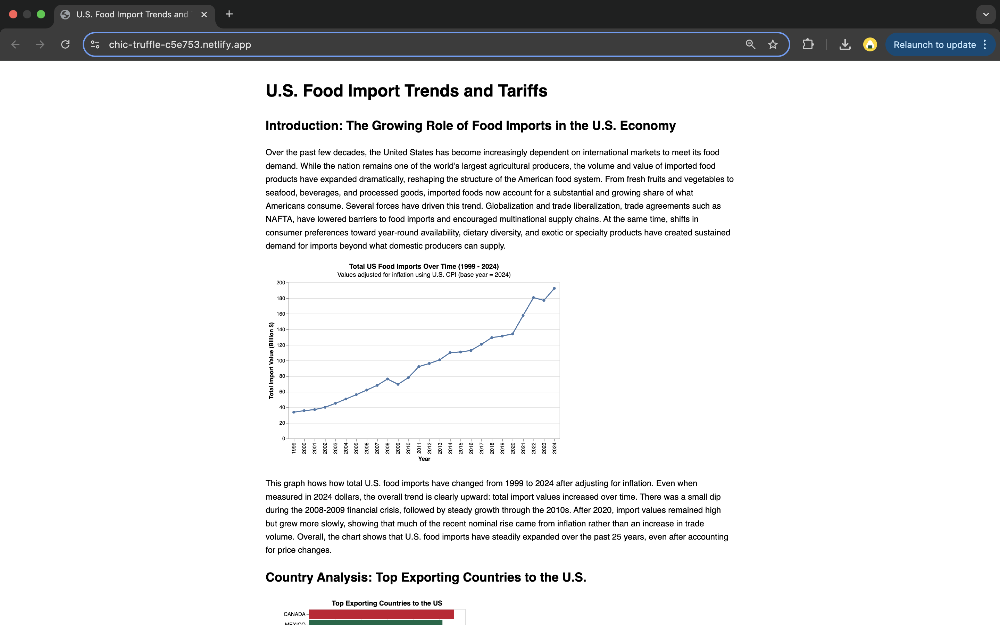
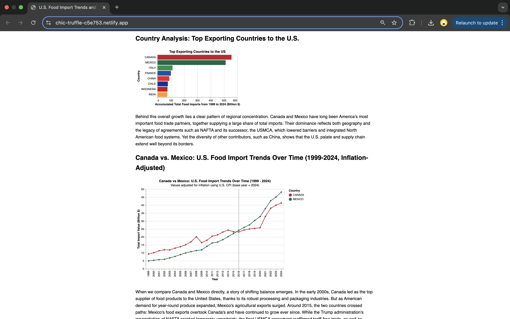
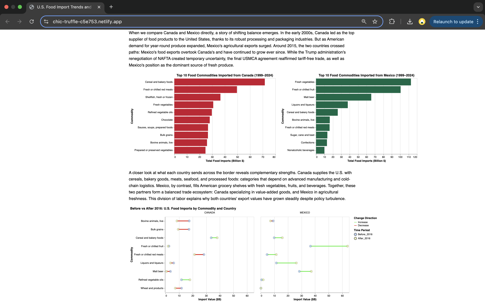
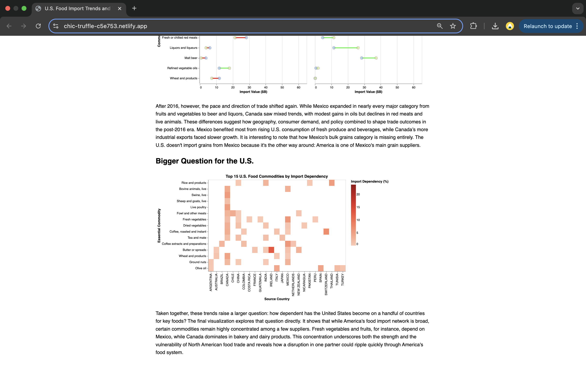

# U.S. Food Import Trends (1999 - 2024)

Tina Dou

## Description

This project is a data visualization website that analyzes and presents trends in U.S. food imports over the 25-year period from 1999 to 2024. It explores import patterns, key trading partners (particularly Canada and Mexico), commodity composition, and the broader implications of America's growing reliance on imported foods.

The website uses a clean, text-and-image format to present this economic analysis, making it suitable for students, policymakers, or anyone interested in food systems and international trade patterns.

## Data Sources

Economic Research Service, U.S. Department of Agriculture. (2025, April 21). U.S. food imports [Dataset]. Data.gov. https://catalog.data.gov/dataset/u-s-food-imports
