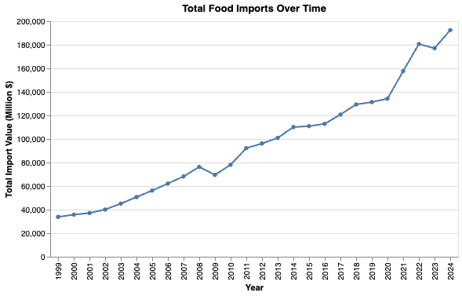
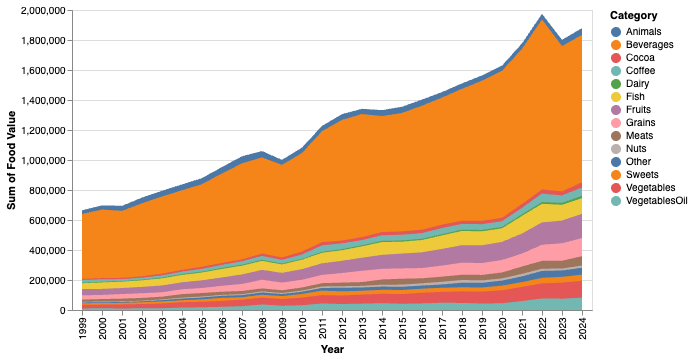
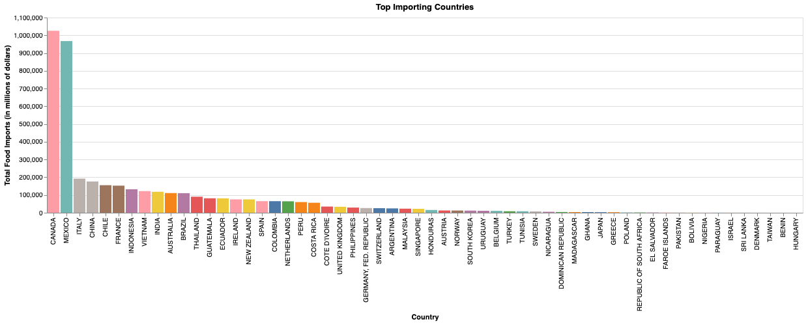
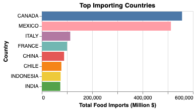
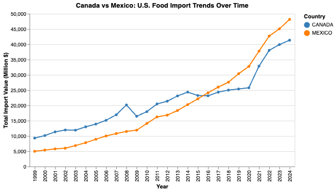
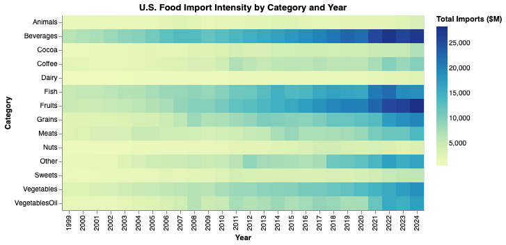
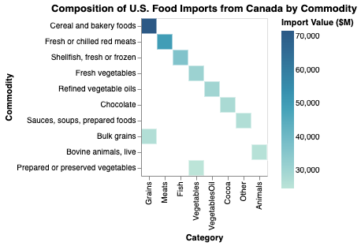
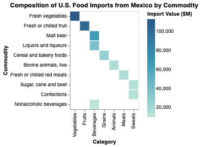
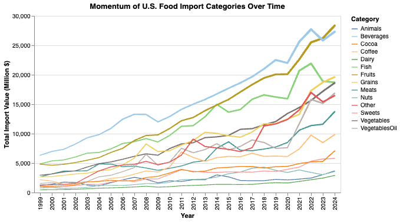

# U.S. Food Imports

Tina Dou

## What is your current goal? Has it changed since the proposal?

My current goal is to create a compelling narrative about U.S. food import patterns, with a specific focus on consumer trends and category-level analysis. While my original proposal looked at overall food imports, I've refined my focus to drill down into specific food categories like meats, beverages, and produce to tell more engaging stories about American consumption habits. I want to move beyond generic overall trends and explore questions like: What types of meat does America import most? How have beverage preferences changed over time? Which countries specialize in exporting specific food categories to the U.S.?

## Are there data challenges you are facing? Are you currently depending on mock data?

I'm facing one significant data challenge that I plan to address before the final submission: data duplication in commodity categories. The dataset contains both aggregate categories (like "Total live animals") and their subcomponents, which means some visualizations may be double-counting values. For example, "Total live animals" likely includes all the individual animal categories beneath it. I'm currently using the raw data but will need to filter out these aggregate categories to ensure accurate analysis. This is particularly important for charts that show composition or market share.

## Describe each of the provided images with 2-3 sentences to give the context and how it relates to your goal.

This chart introduces the overall trajectory of U.S. food import value across the available years in the dataset. 
After cleaning the data to remove world-level aggregates and non-monetary units, the line represents the sum of all import values (in millions of dollars) for each year. 
The trend provides a clear starting point for understanding how U.S. food imports have grown and fluctuated over time, 
forming the baseline context for deeper analyses by category and country in later visuals.

This stacked percentage area chart visualizes how the composition of U.S. food imports has evolved over time across all available categories. 
Each band represents a category’s share of total imports in a given year, with the height normalized to 100%.

The inclusion of all categories highlights the broad diversity of imported food products—from animal and plant commodities to processed goods and specialty items. 
While some categories maintain a relatively stable share, others fluctuate substantially across the years, revealing shifts in consumer demand, production costs, and trade policies.

The chart uses a non-default color palette to help differentiate overlapping regions and draw attention to structural changes rather than year-to-year noise. 
This visualization builds directly on the overall trend in Visualization 1, adding context about what kinds of goods are driving the long-term increase in import value.

This horizontal bar chart ranks the eight countries that have cumulatively exported the most food to the United States across all available years. 
Each bar’s length reflects the total import value in millions of dollars. 
Canada and Mexico lead the list by a large margin, followed by other major suppliers such as China.

The horizontal layout and color-coded bars make cross-country comparisons straightforward, while limiting the display to the top eight ensures clarity without losing key context about the U.S.’s major long-term trading partners.

This visualization isolates the two largest U.S. food import partners — Canada and Mexico — to examine how their contributions have changed over time.
The chart shows that both countries exhibit steady growth in export value to the U.S..
The dual-line comparison reinforces the geographic concentration seen in earlier charts while hinting at differing growth dynamics between the two neighbors.

This heatmap visualizes how the value of U.S. food imports changed across categories and years.
Darker cells indicate higher import volumes, revealing structural shifts.
The visual highlights how diversification in imported foods has grown alongside globalization and trade liberalization.

This visualization decomposes Canada’s food exports to the United States into their underlying product categories and commodities. 
Each rectangle’s size represents the total import value, with darker tones denoting higher volumes.
The treemap reveals that Canada’s largest contributions come from Meats and Grains, followed by Dairy and Beverages. 
The visualization highlights how trade relationships are concentrated in specific commodity clusters, reflecting Canada’s strong agricultural export sectors and North American supply-chain integration.

This visualization replaces the faceted small-multiples view with a motion-based trail plot that 
emphasizes the intensity and trajectory of import growth across categories. 
Each line’s thickness represents the magnitude of total imports in a given year, 
creating a visual sense of "momentum" that highlights both scale and trend simultaneously.

Compared to earlier visualizations, this design conveys not only direction (upward or downward) 
but also relative strength — thicker trails show where imports expanded most aggressively. 
For example, large trails for categories such as Meats or Grains indicate dominant and sustained growth,
while thinner, more fluctuating paths represent smaller or more volatile sectors.

I chose this chart type because it visually balances readability with motion, making 
structural differences across categories feel dynamic rather than static. 
It complements the earlier stacked area chart by shifting the focus from composition (shares) 
to movement (change velocity), reinforcing the story of accelerating U.S. food import demand.

Tip: The markdown syntax  will let you embed images directly, or you can number them and describe them by number in this file.

## What form do you envision your final narrative taking? (e.g. An article incorporating the images? A poster? An infographic?)

An article incorporating the images.